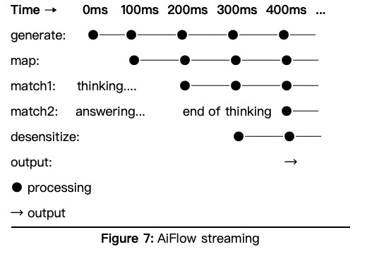
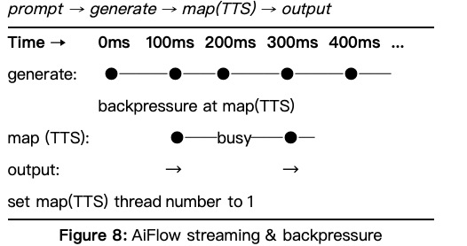
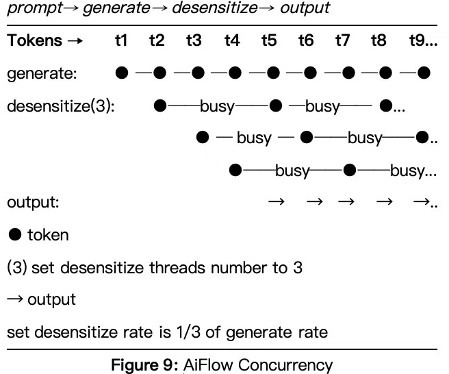

# Experimental Case

## Experimental Overview

### Experiment 1: Streaming Processing



**Scenario Description:**

This experiment evaluates the frameworks' capability to handle complex AI-generated content streams containing both reasoning traces and final responses. The test simulates a conversational AI system where the model interleaves internal thinking patterns with actual responses, requiring real-time content separation and processing.

**Experimental Conditions:**

- **Content Generation:**
  - Output frequency: 100ms intervals.
  - Total outputs: 100 items (50 reasoning traces, 50 responses).
- **Processing Pipeline:**
  - Two-stage desensitization process.
  - Each processing stage introduces 100ms delay.
  - Content logging for non-reasoning outputs.
- **Measurement Parameters:**
  - Time To First Token (TTFT): From request initiation to first output.
  - Total latency: Complete processing time for all items.
  - Processing delay: Time spent in content handling stages.

**Performance Metrics:**

|  Metric |  AIFlow | LCEL | RX+LLM |
|---|---|---|---|
| TTFT | 210ms ± 10ms | 280ms ± 5ms | 300ms ± 10ms |
| Total Latency | 10.9s ± 0.1s | 21.8s ± 0.1s | 21.8s ± 0.1s |
| Log Delay | 5.4s ± 0.1s | 10.9s ± 0.1s | 11s ± 0.1s |

**Code Implementation:**

**AIFlow:**

```java
class DesensitizeCase {
    private final ChatFlowModel model = new ChatFlowModel((prompt, chatOption) -> Choir.create(emitter -> {
        emitter.emit(new AiMessage("<think>"));
        SleepUtil.sleep(100);
        for (int i = 0; i < 48; i++) {
            emitter.emit(new AiMessage(String.valueOf(i)));
            SleepUtil.sleep(100);
        }
        emitter.emit(new AiMessage("</think>"));
        SleepUtil.sleep(100);
        for (int i = 100; i < 150; i++) {
            emitter.emit(new AiMessage(String.valueOf(i)));
            SleepUtil.sleep(100);
        }
        emitter.complete();
    }), ChatOption.custom().model("modelName").stream(true).build());

    private final AiProcessFlow<Tip, String> flow = AiFlows.<Tip>create()
            .prompt(Prompts.human("{{0}}"))
            .generate(model)
            .map(this::classic)
            .conditions()
            .when(chunk -> chunk.isThinkContent, input -> input)
            .others(input -> {
                this.log(input);
                return input;
            })
            .map(this::mockDesensitize1)
            .map(this::mockDesensitize2)
            .close();

    @Test
    void run() {
        AtomicInteger counter = new AtomicInteger(0);
        long startTime = System.currentTimeMillis();
        System.out.printf("time:%s, start.\n", startTime);
        ConverseLatch<String> result = flow.converse(new FlowSession(true)).doOnConsume(answer -> {
            System.out.printf("time:%s, chunk=%s\n", System.currentTimeMillis(), answer);
            counter.incrementAndGet();
        }).offer(Tip.fromArray("hi"));
        result.await();
        System.out.printf("time:%s, cost=%s\n", System.currentTimeMillis(), System.currentTimeMillis() - startTime);
        Assertions.assertEquals(100, counter.get());
    }

    private Chunk classic(ChatMessage message, StateContext ctx) {
        if (message.text().trim().equals("<think>")) {
            ctx.setState("isThinking", true);
            return new Chunk(true, message.text());
        }
        if (message.text().trim().equals("</think>")) {
            ctx.setState("isThinking", false);
            return new Chunk(true, message.text());
        }
        if (Boolean.TRUE.equals(ctx.getState("isThinking"))) {
            return new Chunk(true, message.text());
        }
        return new Chunk(false, message.text());
    }

    private String mockDesensitize1(Chunk chunk) {
        SleepUtil.sleep(100);
        return chunk.content.replace("3", "*");
    }

    private String mockDesensitize2(String chunk) {
        SleepUtil.sleep(100);
        return chunk.replace("4", "*");
    }

    private void log(Chunk chunk) {
        System.out.println("log content:" + chunk.content);
    }

    private static class Chunk {
        private final boolean isThinkContent;
        private final String content;

        private Chunk(boolean isThinkContent, String content) {this.isThinkContent = isThinkContent;
            this.content = content;
        }
    }
}
```

**LCEL:**

``` python
import asyncio
from typing import AsyncGenerator, Dict, Any
from langchain_core.runnables import Runnable
from langchain_core.prompts import ChatPromptTemplate
import time

class MockStreamingModel(Runnable):
    async def astream(self, input: Dict[str, Any], config=None) -> AsyncGenerator[str, None]:
        data_list = []
        data_list.append('<think>')
        for i in range(48):
            data_list.append(str(i))
        data_list.append('</think>')

        for i in range(50):
            data_list.append(str(i + 100))

        for data in data_list:
            pre_time = time.time()
            yield data
            diff = (time.time() - pre_time) * 1000
            if diff < 100:
                await asyncio.sleep((100 - diff) / 1000)

    async def invoke(self, input: Dict[str, Any], config=None) -> str:
        pass

async def classic(input_stream):
    is_thinking = False
    async for input in input_stream:
        if not isinstance(input, str):
            continue
        if input.startswith('<think>'):
            is_thinking = True
            yield {"isThinkingContent": True, "content": input}
            continue
        elif input.endswith('</think>'):
            yield {"isThinkingContent": True, "content": input}
            is_thinking = False
            continue
        if is_thinking:
            yield {"isThinkingContent": True, "content": input}
            continue
        yield {"isThinkingContent": False, "content": input}

async def process_before(input_stream):
    async for input in input_stream:
        if not input["isThinkingContent"]:
            log(input['content'])
        yield input

def log(input):
    print(f"{time.time() * 1000} Log: {input}")

async def mock_desensitize1(input_stream):
    async for input in input_stream:
        await asyncio.sleep(0.1)
        yield input['content'].replace('3', '*')

async def mock_desensitize2(input_stream):
    async for input in input_stream:
        await asyncio.sleep(0.1)
        yield input.replace('4', '*')


async def main():
    prompt_template = ChatPromptTemplate.from_messages([
        ("human", "{user_input}")
    ])
    model = MockStreamingModel()
    
    chain = prompt_template | model | classic | process_before | mock_desensitize1 | mock_desensitize2
    
    async for text in chain.astream("hi"):
        print(f"{(time.time() * 1000):.3f} output: {text}")

start = time.time()
print(f"start at: {start * 1000:.3f}(ms)")
asyncio.run(main())
print(f"take time: {(time.time() - start) * 1000:.3f}(ms)")
```

**RX+LLM:**

```java
package modelengine.fel.engine;

import reactor.core.publisher.Flux;
import reactor.core.publisher.Mono;

import java.util.ArrayList;
import java.util.List;
import java.util.Map;
import java.util.concurrent.CountDownLatch;
import java.util.concurrent.atomic.AtomicReference;

public class DesensitizeCase {
    public static void main(String[] args) throws InterruptedException {
        String userInput = "hi";
        long startTime = System.currentTimeMillis();
        System.out.printf("start at: %.3f(ms)%n", (double) startTime);

        Flux<String> result = Mono.just(Map.of("user_input", userInput))
                .flatMapMany(DesensitizeCase::mockStreamModel)
                .transform(DesensitizeCase::classic)
                .map(DesensitizeCase::log)
                .map(DesensitizeCase::mockDesensitize1)
                .map(DesensitizeCase::mockDesensitize2);

        CountDownLatch waiter = new CountDownLatch(1);
        result.subscribe(text -> System.out.printf("%.3f output: %s%n", (double) System.currentTimeMillis(), text),
                error -> System.err.println("Error: " + error),
                () -> {
                    long endTime = System.currentTimeMillis();
                    System.out.printf("take time: %.3f(ms)%n", (double) (endTime - startTime));
                    waiter.countDown();
                });

        waiter.await();
    }

    private static Flux<String> mockStreamModel(Map<String, String> input) {
        List<String> dataList = new ArrayList<>();
        dataList.add("<think>");
        for (int i = 0; i < 48; i++) {
            dataList.add(String.valueOf(i));
        }
        dataList.add("</think>");
        for (int i = 0; i < 50; i++) {
            dataList.add(String.valueOf(i + 100));
        }

        long startTime = System.currentTimeMillis();
        return Flux.generate(() -> 0, (state, sink) -> {
            long diff = System.currentTimeMillis() - startTime;
            if (diff < state * 100) {
                sleep(state * 100 - diff);
            }
            sink.next(dataList.get(state));
            if (state == 99) {
                sink.complete();
            }
            return state + 1;
        });
    }

    private static Flux<Chunk> classic(Flux<String> stream) {
        AtomicReference<Boolean> isThinking = new AtomicReference<>(false);
        return stream.map(message -> {
            if (message.trim().equals("<think>")) {
                isThinking.set(true);
                return new Chunk(true, message);
            }
            if (message.trim().equals("</think>")) {
                isThinking.set(false);
                return new Chunk(true, message);
            }
            if (Boolean.TRUE.equals(isThinking.get())) {
                return new Chunk(true, message);
            }
            return new Chunk(false, message);
        });
    }

    private static String mockDesensitize1(Chunk input) {
        sleep(100);
        return input.content.replace("3", "*");
    }

    private static String mockDesensitize2(String input) {
        sleep(100);
        return input.replace("4", "*");
    }

    private static Chunk log(Chunk chunk) {
        if (!chunk.isThinkContent) {
            System.out.println("log content:" + chunk.content);
        }
        return chunk;
    }

    private static void sleep(long ms) {
        try {
            Thread.sleep(ms);
        } catch (InterruptedException e) {
            Thread.currentThread().interrupt();
        }
    }

    private static class Chunk {
        private final boolean isThinkContent;
        private final String content;

        private Chunk(boolean isThinkContent, String content) {
            this.isThinkContent = isThinkContent;
            this.content = content;
        }
    }
}
```

---

### Experiment 2: Backpressure Handling Under Single-Thread Constraints



**Scenario Description:**

This test examines how each framework manages processing bottlenecks when downstream components cannot keep pace with the model's output speed. The experiment creates an artificial performance mismatch to evaluate backpressure handling mechanisms.

**Experimental Conditions:**

- **Content Generation:**
  - Output frequency: 50ms intervals.
  - Total outputs: 100 text chunks.
- **Processing Constraints:**
  - Desensitization delay: 100ms.
  - Text-to-audio conversion delay: 100ms.
  - Strict single-thread execution for both stages.
- **Measurement Focus:**
  - System stability under sustained backpressure.
  - Resource utilization patterns.
  - End-to-end latency impact.

**Performance Metrics:**

| Metric | AIFlow | LCEL | RX+LLM |
|---|---|---|---|
| TTFT | 210ms ± 10ms | 280ms ± 10ms | 300ms ± 10ms |
| Total Latency | 12.5s ± 0.1s | 21.9s ± 0.1s | 21.8s ± 0.1s |

**Code Implementation:**

**AIFlow:**

```java
class BackPressureCase {
    private final ChatFlowModel model = new ChatFlowModel((prompt, chatOption) -> Choir.create(emitter -> {
        for (int i = 0; i < 100; i++) {
            emitter.emit(new AiMessage(String.valueOf(i)));
            SleepUtil.sleep(50);
        }
        emitter.complete();
        System.out.printf("time:%s, generate completed.\n", System.currentTimeMillis());
    }), ChatOption.custom().model("modelName").stream(true).build());

    private final AiProcessFlow<Tip, String> flow = AiFlows.<Tip>create()
            .prompt(Prompts.human("{{0}}"))
            .generate(model)
            .map(this::mockDesensitize).concurrency(1) // Limit processing to 1 concurrent thread
            .map(this::mockTTS).concurrency(1) // Limit processing to 1 concurrent thread
            .close();

    @Test
    void run() {
        AtomicInteger counter = new AtomicInteger(0);
        long startTime = System.currentTimeMillis();
        System.out.printf("time:%s, start.\n", startTime);
        ConverseLatch<String> result = flow.converse(new FlowSession(false)).doOnConsume(answer -> {
            System.out.printf("time:%s, chunk=%s\n", System.currentTimeMillis(), answer);
            counter.incrementAndGet();
        }).offer(Tip.fromArray("hi"));
        result.await();
        System.out.printf("time:%s, cost=%s\n", System.currentTimeMillis(), System.currentTimeMillis() - startTime);
        Assertions.assertEquals(100, counter.get());
    }

    private String mockDesensitize(ChatMessage chunk) {
        // Simulate time-consuming operation with a delay.
        SleepUtil.sleep(100);
        return chunk.text().replace("3", "*");
    }

    private String mockTTS(String chunk) {
        // Simulate time-consuming operation with a delay.
        SleepUtil.sleep(100);
        return chunk;
    }
}
```

**LCEL:**

```python
import asyncio
from typing import AsyncGenerator, Dict, Any
from langchain_core.runnables import Runnable
from langchain_core.prompts import ChatPromptTemplate
import time

class MockStreamingModel(Runnable):
    async def astream(self, input: Dict[str, Any], config=None) -> AsyncGenerator[str, None]:
        pre_time = time.time()
        for i in range(100):
            pre_time = time.time()
            yield str(i)
            diff = (time.time() - pre_time) * 1000
            if diff < 50:
                await asyncio.sleep((50 - diff) / 1000)

    async def invoke(self, input: Dict[str, Any], config=None) -> str:
        pass

async def mock_desensitize(input_stream):
    async for input in input_stream:
        await asyncio.sleep(0.1)
        yield input.replace('3', '*')

async def mock_tts(input_stream):
    async for input in input_stream:
        await asyncio.sleep(0.1)
        yield input


async def main():
    model = MockStreamingModel()
    prompt_template = ChatPromptTemplate.from_messages([
        ("human", "{user_input}")
    ])
    
    chain = prompt_template | model | mock_desensitize | mock_tts
    
    async for text in chain.astream("hi"):
        print(f"{time.time() * 1000} output: {text}")

start = time.time()
print(f"start at: {start * 1000:.3f}(ms)")
asyncio.run(main())
print(f"take time: {(time.time() - start) * 1000:.3f}(ms)")
```

**RX+LLM:**

```java
package modelengine.fel.engine;

import reactor.core.publisher.Flux;
import reactor.core.publisher.Mono;

import java.util.Map;
import java.util.concurrent.CountDownLatch;

public class BackPressureCase {
    public static void main(String[] args) throws InterruptedException {
        String userInput = "hi";
        long startTime = System.currentTimeMillis();
        System.out.printf("start at: %.3f(ms)%n", (double) startTime);

        Flux<String> result = Mono.just(Map.of("user_input", userInput))
                .flatMapMany(BackPressureCase::mockStreamModel)
                .map(BackPressureCase::mockDesensitize)
                .map(BackPressureCase::mockTTS);

        CountDownLatch waiter = new CountDownLatch(1);
        result.subscribe(text -> System.out.printf("%.3f output: %s%n", (double) System.currentTimeMillis(), text),
                error -> System.err.println("Error: " + error),
                () -> {
                    long endTime = System.currentTimeMillis();
                    System.out.printf("take time: %.3f(ms)%n", (double) (endTime - startTime));
                    waiter.countDown();
                });

        waiter.await();
    }

    private static Flux<String> mockStreamModel(Map<String, String> input) {
        long startTime = System.currentTimeMillis();
        return Flux.generate(() -> 0, (state, sink) -> {
            long diff = System.currentTimeMillis() - startTime;
            if (diff < state * 50) {
                sleep(state * 50 - diff);
            }
            sink.next(String.valueOf(state));
            if (state == 99) {
                sink.complete();
            }
            return state + 1;
        });
    }

    private static String mockDesensitize(String input) {
        sleep(100);
        return input.replace("3", "*");
    }

    private static String mockTTS(String input) {
        sleep(100);
        return input;
    }

    private static void sleep(long ms) {
        try {
            Thread.sleep(ms);
        } catch (InterruptedException e) {
            Thread.currentThread().interrupt();
        }
    }
}
```

---

### Experiment 3: Concurrent Processing Performance



**Scenario Description:**

This experiment measures throughput optimization under constrained parallel processing conditions. The test simulates a CPU-intensive text processing workload with controlled concurrency limits.

**Experimental Conditions:**

- **Content Generation:**
  - Output frequency: 100ms intervals.
  - Total outputs: 100 items.
- **Processing Setup:**
  - Text processing delay: 300ms per item.
  - Fixed concurrency level: 3 threads.
- **Measurement Parameters:**
  - Throughput under concurrent load.
  - Resource contention analysis.
  - Scaling efficiency.

**Performance Metrics:**

| Metric | AIFlow | LCEL | RX+LLM |
|---|---|---|---|
| TTFT | 310ms ± 10ms | 380ms ± 10ms | 400ms ± 10ms |
| Total Latency | 11.2s ± 0.1s | 31.6s ± 0.1s | 12.1s ± 0.1s |

**Code Implementation:**

**AIFlow:**

```java
class ConcurrencyCase {
    private final ChatFlowModel model = new ChatFlowModel((prompt, chatOption) -> Choir.create(emitter -> {
        for (int i = 0; i < 100; i++) {
            emitter.emit(new AiMessage(String.valueOf(i)));
            SleepUtil.sleep(100);
        }
        emitter.complete();
    }), ChatOption.custom().model("modelName").stream(true).build());

    private final AiProcessFlow<Tip, String> flow = AiFlows.<Tip>create()
            .prompt(Prompts.human("{{0}}"))
            .generate(model)
            .map(this::mockDesensitize).concurrency(3) // Set processing to 3 concurrent thread
            .close();

    @Test
    void run() {
        AtomicInteger counter = new AtomicInteger(0);
        long startTime = System.currentTimeMillis();
        System.out.printf("time:%s, start.\n", startTime);
        ConverseLatch<String> result = flow.converse(new FlowSession(false)).doOnConsume(answer -> {
            System.out.printf("time:%s, chunk=%s\n", System.currentTimeMillis(), answer);
            counter.incrementAndGet();
        }).offer(Tip.fromArray("hi"));
        result.await();
        System.out.printf("time:%s, cost=%s\n", System.currentTimeMillis(), System.currentTimeMillis() - startTime);
        Assertions.assertEquals(100, counter.get());
    }

    private String mockDesensitize(ChatMessage chunk) {
        // Simulate slower processing at 1/3 speed of LLM generation.
        SleepUtil.sleep(300);
        return chunk.text().replace("3", "*");
    }
}
```

**LCEL:**

```python
import asyncio
from typing import AsyncGenerator, Dict, Any
from langchain_core.runnables import Runnable
from langchain_core.prompts import ChatPromptTemplate
import time

class MockStreamingModel(Runnable):
    async def astream(self, input: Dict[str, Any], config=None) -> AsyncGenerator[str, None]:
        pre_time = time.time()
        for i in range(100):
            pre_time = time.time()
            yield str(i)
            diff = (time.time() - pre_time) * 1000
            if diff < 100:
                await asyncio.sleep((100 - diff) / 1000)

    async def invoke(self, input: Dict[str, Any], config=None) -> str:
        pass


async def mock_desensitize(input_stream):
    async for input in input_stream:
        await asyncio.sleep(0.3)
        yield input


async def main():
    model = MockStreamingModel()
    prompt_template = ChatPromptTemplate.from_messages([
        ("human", "{user_input}")
    ])
    
    chain = prompt_template | model | mock_desensitize
    
    async for text in chain.astream("hi"):
        print(f"{time.time() * 1000} output: {text}")

start = time.time()
print(f"start at: {start * 1000:.3f}(ms)")
asyncio.run(main())
print(f"take time: {(time.time() - start) * 1000:.3f}(ms)")
```

**RX+LLM:**

```java
package modelengine.fel.engine;

import reactor.core.publisher.Flux;
import reactor.core.publisher.Mono;
import reactor.core.scheduler.Schedulers;

import java.time.Duration;
import java.util.Map;
import java.util.concurrent.CountDownLatch;

public class ConcurrencyCase {
    public static void main(String[] args) throws InterruptedException {
        String userInput = "hi";
        long startTime = System.currentTimeMillis();
        System.out.printf("start at: %.3f(ms)%n", (double) startTime);

        Flux<String> result = Mono.just(Map.of("user_input", userInput))
                .flatMapMany(ConcurrencyCase::mockStreamModel)
                .parallel(3)
                .runOn(Schedulers.parallel())
                .map(ConcurrencyCase::mockDesensitize)
                .sequential();

        CountDownLatch waiter = new CountDownLatch(1);
        result.subscribe(text -> System.out.printf("%.3f output: %s%n", (double) System.currentTimeMillis(), text),
                error -> System.err.println("Error: " + error),
                () -> {
                    long endTime = System.currentTimeMillis();
                    System.out.printf("take time: %.3f(ms)%n", (double) (endTime - startTime));
                    waiter.countDown();
                });

        waiter.await();
    }

    private static Flux<String> mockStreamModel(Map<String, String> input) {
        Flux<Integer> firstElement = Flux.just(0);
        Flux<Integer> restElements = Flux.range(1, 99).delayElements(Duration.ofMillis(100));

        return Flux.concat(firstElement, restElements).map(String::valueOf);
    }

    private static String mockDesensitize(String input) {
        sleep(300);
        return input.replace("3", "*");
    }

    private static void sleep(long ms) {
        try {
            Thread.sleep(ms);
        } catch (InterruptedException e) {
            Thread.currentThread().interrupt();
        }
    }
}
```