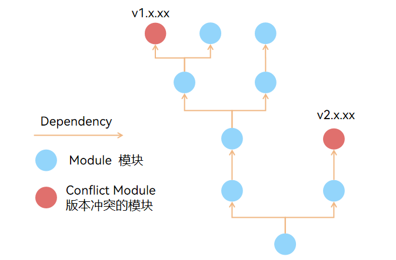
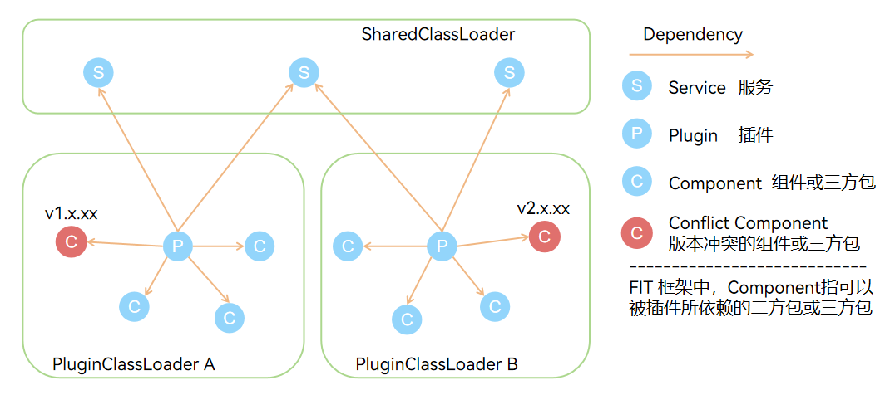

# FIT 框架：插件化架构如何彻底解决大型项目依赖管理难题？

在传统 Java 开发模式中，大型项目的依赖管理问题一直是开发团队的痛点。无论是依赖版本冲突、服务更新时的依赖调整，还是模块间的耦合性问题，都像一张错综复杂的蜘蛛网，让开发者疲于应对。然而，FIT 框架的出现，彻底改变了这一局面。它以插件化架构为核心，通过自定义的类加载隔离机制，将复杂依赖问题简化为插件与接口之间的清晰关系，为传统开发模式中棘手的依赖排查问题提供了一种全新的解决方案。

## 传统 Java 开发中的依赖困境
在传统的 Java 项目中，依赖管理往往面临多种困难：

- 依赖冲突
当多个模块引入不同版本的同一库时，可能会导致运行时异常或功能异常。例如`NoSuchMethodException`错误常常让人头疼不已。
- 模块耦合性高
各模块之间直接依赖，导致代码难以拆分、复用和维护。
- 服务升级困难
在微服务架构下，每次服务更新都需要重新梳理依赖树，确保兼容性。这不仅耗费大量时间，还容易遗漏潜在问题。

这些问题使得大型项目的开发效率低下，维护成本高昂。而 FIT 框架正是为了解决这些痛点而生。

## FIT 框架的核心优势：插件化架构

FIT 框架的核心架构是插件化开发，通过自定义类加载器实现了插件间的类隔离，同时插件通过依赖接口的方式来实现插件间协作。这种设计带来了以下几个显著优势：

1. 插件间的完全隔离，告别依赖冲突 

FIT 框架为每个插件分配独立的`PluginClassLoader`，这些类加载器彼此平行，互不干扰。每个插件拥有自己的类加载环境，就像一个个独立的小宇宙，即使使用不同版本的第三方库也不会产生冲突。

> 想象一下，如果你的家里有一群宠物，每只宠物都有自己的笼子和专属食物，它们之间不会争夺资源，也不会互相影响。这就是 FIT 框架中插件隔离的效果——每个插件都能自由地选择自己需要的依赖，而不必担心其他插件的影响。

2. 接口驱动的松耦合设计

FIT 框架提倡通过接口来定义插件间的服务契约。插件只需要实现特定的接口，并通过共享类加载器加载这些接口，即可为这些接口提供具体实现，或使用其他插件实现的该接口的功能。这种方式极大地降低了模块间的耦合度，使系统更加灵活。

> 如果把插件比作乐手，那么接口就是乐谱。每个乐手只需按照乐谱演奏，无需关心其他乐手如何表演，最终却能组成一首和谐的交响曲。

3. 动态加载与热部署，提升开发效率

FIT 框架支持插件的热插拔，这意味着你可以在不重启的情况下更新某个插件的功能。

> 插件化开发就像汽车发动机的模块化设计，当某个零件损坏时，你不需要拆卸整个引擎，只需更换对应的模块即可恢复运行。FIT 框架赋予了你的应用程序同样的灵活性。

## 传统 Java 开发 vs FIT 框架开发
为了更直观地展示 FIT 框架的优势，我们通过一个简单的图示对比传统 Java 开发模式和 FIT 框架开发模式下的依赖配置。

### 传统 Java 开发依赖模式

- 在传统 Java 开发模式中，我们通常依赖 Maven 或 Gradle 等工具来进行模块之间的依赖管理。然而，由于模块之间的依赖关系是无限制的，在大型项目中，依赖树往往会逐渐扩展到庞大的规模，依赖链变得极其复杂且冗长。

- 如上图所示，当依赖树的不同节点中引入了不同版本的同一库时，很容易因为版本冲突导致项目出现大规模的报错。这种情况在传统开发模式下屡见不鲜，而工程师们往往只能顺着依赖树逐一排查问题，这种方式不仅低效，还容易遗漏潜在的风险。更糟糕的是，即便问题暂时解决，类似的情况也很可能在未来的开发或升级中再次发生。长期以来，工程师们已经习惯了这种‘治标不治本’的解决方案。尽管大家深知这种模式带来的痛苦——从版本冲突到依赖管理的复杂性，再到排查问题的时间成本——但由于缺乏更好的替代方案，团队往往只能选择忍受。这种‘戴着镣铐跳舞’的开发方式，已经成为行业内的无奈常态。

### FIT 框架依赖模式

- 而在 FIT 框架中，不同的功能的模块分别被定义为`Component`（组件）、`Plugin`（插件）、`Service`（插件服务）三部分，他们之间的依赖关系如图所示:
  - 插件可以依赖插件服务，是插件服务的具体实现，不同插件可以实现同一个插件服务，从而实现功能的多态，且插件之间互相隔离，互不干扰。
  - 而组件是指各插件所依赖的通用功能，通常属于二方包。
  - 同时插件可以依赖三方包来进行使用。
  - 插件无法依赖于插件。
- 在 FIT 框架的开发模式下，类加载隔离机制天然保证插件及其所依赖的二方包、三方包是与其他插件所隔离的，尽管此时两个插件同时依赖了不同版本的同一库，它们之间也不会产生任何冲突，可以根据需要为插件引入相应版本的依赖，无需进行版本的统一。

## 为什么选择 FIT？
- 开箱即用的插件化支持
FIT 框架内置了完整的插件管理机制，从类加载到生命周期管理，开发者无需额外配置即可享受插件化的便利。
- 高度可定制性
FIT 框架允许开发者根据需求自定义类加载逻辑、日志系统、事务管理等功能，满足各种复杂场景的需求。
- 无缝集成主流技术栈
FIT 框架兼容 MyBatis、Druid 等主流技术栈，同时也支持 Swagger、Log4j2 等工具的无缝接入，所有生态组件都能以比较方便的方式自主接入，让你无需放弃现有技术积累。

## 加入 FIT 社区，共创未来
FIT 框架不仅仅是一个工具，更是一种全新的开发理念，插件化架构将成为未来软件开发的重要趋势。无论你是企业开发者、高校学生，还是热爱编程的个人爱好者，FIT 都欢迎你的加入！

- 贡献代码 ：参与 FIT 的核心开发，帮助完善框架功能。
- 分享经验 ：撰写文章或录制视频，向更多人介绍 FIT 的魅力。
- 提出建议 ：告诉我们你的需求，让我们共同打造更好的 FIT。

FIT 框架以其独特的插件化架构和类隔离加载机制，为大型项目依赖管理开辟了一条康庄大道。它不仅解决了传统 Java 开发中的诸多难题，更为未来的软件开发树立了标杆。现在就行动起来，加入 FIT 社区，一起探索插件化开发的无限可能吧！

官方网站 : http://fitframework.io

期待你的到来！