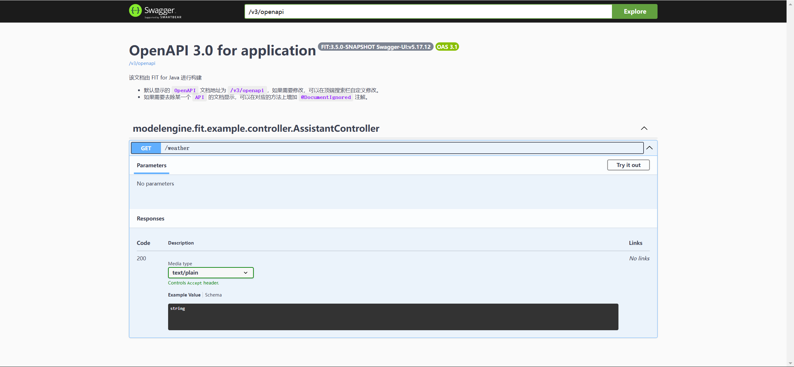

# FIT框架：重新定义模块隔离与部署自由，让 Swagger 从生产环境“优雅消失”

在`Java`开发领域，模块化设计的出现曾让无数开发者赞叹其便捷性，在开发大型项目时，我们通过层层依赖来构建一个庞大复杂的系统，但当我们将目光投向生产环境时，一个令人头疼的问题始终存在：那些为开发调试而生的工具（如`Swagger`等）为何总是“赖在”生产环境的代码里？这不仅增加了安全风险，还让部署包变得臃肿。而 FIT 框架的插件化开发，正以一场“代码瘦身革命”，重新定义开发与生产环境的边界！

## 传统模块化的痛点：Swagger 为何成了生产环境的“钉子户”？
### 传统 Spring 项目的困境

在 Spring 项目中，`Swagger`的集成通常需要以下步骤：

- 添加`swagger`功能的相关依赖
- 编写`Swagger`配置类（如`SwaggerConfig.java`）
- 通过`@Profile("dev")`控制`Swagger`仅在开发环境启用

看似完美？但问题在于：即使`Swagger`在生产环境被禁用，其依赖和配置代码仍会随业务代码一同打包部署。这带来两大隐患：

- 安全漏洞：若生产环境配置失误，`Swagger UI`可能意外暴露 API 文档，可能会受到黑客攻击，同时，当代码存在于生产环境中时，人为难以证明通过配置开关真正关闭了所有逻辑的入口，代码中的某些静态变量和可执行段可能会成为黑客进行二进制攻击的切入点。
- 资源浪费：无用的依赖占用了宝贵的容器内存，影响性能。

### 开发者常见的“妥协方案”

- 手动注释代码：上线前注释`Swagger`配置，或单独增加配置将`Swagger`排除出生产环境，但容易引发人为失误。
- 多分支管理：通过`Git`分支隔离环境配置，但增加了代码维护成本。
- 依赖排除：使用`Maven/Gradle`的`exclude`功能，但操作繁琐且容易破坏依赖树。

这些方案本质上是“补丁”，而非真正的解决方案。

## FIT 的答案：让 Swagger 像“USB 设备”一样即插即用
### FIT 插件化开发的核心逻辑

FIT 框架通过插件化开发模式，彻底解决了上述问题，在 FIT 中，功能模块以插件的形式进行部署，插件之间相互隔离，互不影响，编写代码完毕后，只需要一次编译生成为插件 jar 包，后续可以自由选择是否要在环境上部署，因此，只要在生产环境部署包中不带上`Swagger`插件，环境中就不会含有任何`Swagger`实现相关的代码，也就从根本上解决了上述隐患。

基于 FIT 框架进行插件化代码开发有以下几个方面的优势：

#### 插件完全隔离

FIT 的插件化设计基于以下原则：

- 独立进程：每个插件运行在独立的`FIT Runtime`进程中，插件之间无法直接访问对方的内存或资源。
- 无感知调用：插件之间通过 FIT 的 DSL（领域特定语言）进行通信，插件无需感知其他插件的存在。
- 资源隔离：插件的依赖和配置完全独立，不会污染其他插件或主应用的运行环境。

FIT 通过以下几个组件来实现这样的功能：

|组件| 作用                                      |
|---|-----------------------------------------|
|Genericable	| 定义 Swagger 功能的抽象接口（如生成 API 文档的 DSL）     |
|Fitable	| 实现 Swagger 的具体插件（如基于 Java 的 Swagger 插件） |
|FIT Runtime	| 作为插件加载器，在生产环境上可以自由选择需要部署的插件             |

#### 部署无需修改代码

FIT 的插件化开发实现了物理级的代码隔离，部署生产环境时无需修改或注释任何代码。开发者只需通过配置文件指定需要加载的插件，`FIT Runtime`会自动完成插件的加载和卸载。这种设计不仅简化了部署流程，还避免了人为失误（如忘记注释`Swagger`代码）导致的安全风险。

#### 部署方式自由灵活

FIT 支持多种部署策略，开发者可以根据需求灵活选择：

- 蚂蚁模式（散部署）：每个插件独立部署，适合高度模块化的场景。
- 大象模式（聚部署）：多个插件集中部署，适合功能紧密集成的场景。

这种灵活性使得 FIT 能够适应从单体应用到分布式系统的各种部署需求。

### 实践：无需修改任何代码，让 Swagger 从生产环境“优雅消失”
#### 准备环境

进入项目地址 FIT-Framework，下载项目代码，根据入门指南快速部署你的 FIT 环境，同时参考 [FIT 用户指导手册：插件化开发](../user-guide-book/06.%20插件化开发.md)来学习插件如何部署到用户插件目录中！

以下示例使用到了 [FIT 入门指南：使用插件的热插拔能力](../quick-start-guide/03.%20使用插件的热插拔能力.md)中的插件，其代码地址为 [dynamic-plugin](../../../../../examples/fit-example/03-dynamic-plugin)，您也可以构造一个属于你自己的插件。

#### 部署业务插件

以 [FIT 入门指南：使用插件的热插拔能力](../quick-start-guide/03.%20使用插件的热插拔能力.md)的插件为例。

- 首先启动`fit`进程，关于如何编译 FIT 框架及配置`fit`命令，请参考 [FIT 用户指导手册：插件化开发](../user-guide-book/06.%20插件化开发.md)。

``` bash
fit start
```

- 在用户插件目录中部署`assistant`插件：

``` bash
[yyyy-MM-dd hh:mm:ss.SSS] [INFO ] [directory-monitor-custom-thread-0] [modelengine.fit.plugin.dynamic.DynamicPluginScanner] Dynamic plugin detected. [plugin=D:\demo\custom\assistant-for-dynamic-1.0-SNAPSHOT.jar]
[yyyy-MM-dd hh:mm:ss.SSS] [INFO ] [directory-monitor-custom-thread-0] [modelengine.fit.plugin.dynamic.DynamicPluginScanner] Dynamic plugin loaded. [name=assistant-for-dynamic]
```

当出现以上段落时，表明`assistant`插件加载成功。

- 在用户插件目录中部署`default-weather`插件：

``` bash
[yyyy-MM-dd hh:mm:ss.SSS] [INFO ] [directory-monitor-custom-thread-0] [modelengine.fit.plugin.dynamic.DynamicPluginScanner] Dynamic plugin detected. [plugin=D:\demo\custom\default-weather-for-dynamic-1.0-SNAPSHOT.jar]
[yyyy-MM-dd hh:mm:ss.SSS] [INFO ] [directory-monitor-custom-thread-0] [modelengine.fit.plugin.dynamic.DynamicPluginScanner] Dynamic plugin loaded. [name=default-weather-for-dynamic]
```

当出现以上段落时，表明`default-weather`插件加载成功。此时可以通过地址 `http://localhost:8080/weather` 访问资源。访问成功后，会出现如下的响应：

``` bash
Default weather plugin is working.
```

#### 访问 Swagger 页面

FIT 框架默认配置`Swagger`功能插件，基于上面的操作步骤，访问 `http://localhost:8080/openapi.html` ，会得到以下页面响应：


#### 卸载内置 Swagger 插件

若不希望部署`Swagger`插件，只需要在 FIT 内置插件目录中将`Swagger`插件移除：

首先结束`fit`进程，打开`build/plugins`，该目录存放了编译 FIT 框架后生成的所有内置插件，删除插件`fit-http-openapi3-swagger-3.5.0-SNAPSHOT.jar`，重新启动 FIT 框架，此时环境中并没有部署`Swagger`插件，访问 `http://localhost:8080/openapi.html` 将得到 404 响应：

``` json
{
  "status": 404,
  "error": "Resource not found. [path=/openapi.html]",
  "suppressed": null,
  "path": "/openapi.html",
  "timestamp": "2025-02-10T12:58:06.058421100"
}
```

#### 体验 Swagger 插件的热插拔

根据以上步骤，你已经学会了如何在部署生产环境之前，如何卸载掉内置目录中不需要带上生产环境的模块，那么如何在不关闭进程的前提下，将这些模块变成生产环境上即插即用的插件，来应对一些临时调测的场景呢？

很简单，答案就是用户插件目录：

以`Swagger`插件为例，将`framework/fit/java/fit-builtin/plugins/fit-http-openapi3-swagger/target/fit-http-openapi3-swagger-3.5.0-SNAPSHOT.jar`复制到正在运行的`fit`进程的用户插件目录中，即可立刻实现`Swagger`功能，而在使用结束后，可以随时卸载，无需重启进程。

> 注意，位于`build/plugins`下的插件属于 FIT 启动的内置插件，包含了 FIT 框架提供的一系列功能，并不支持运行时热插拔，用户需要在运行前将无需部署的插件删除。
>
> 而 FIT 用户插件目录支持插件的运行时热插拔，在配置`fit start`启动命令后，用户可以在任意位置新建一个空目录作为用户插件目录，具体配置命令的方式请参考 [FIT 用户指导手册：插件化开发](../user-guide-book/06.%20插件化开发.md)。

## FIT 带来的颠覆性优势 

### 安全性跃升

- 零残留代码：生产环境中完全不存在`Swagger`相关字节码，彻底杜绝误启用风险。
- CVE 漏洞免疫：即使未来`Swagger`曝出安全漏洞，生产环境也无需紧急修复。

### 资源极致优化

- 在传统模块化开发中，即使进行了相关避免上生产环境的配置，`Swagger`相关代码依然会被带上生产环境中，但在 FIT 中，通过插件隔离的方式，可以使生产环境完全不部署相关代码，大大降低了内存空间的使用。

### 运维自由度革命

- 动态插拔：无需重新构建镜像，通过 FIT 的热插拔机制即可动态加载诊断插件（如 Arthas）。
- 环境隔离：FIT 天然将插件之间隔离开来，实现差异化加载。

## Swagger 之外：FIT 插件化的无限可能

这种“环境感知型插件化”能力可延伸至更多场景：

- Mock 服务插件：开发环境自动加载 Mock 数据生成器，生产环境自动剥离。
- 性能监控与剖析插件：需要在预发环境中进行详细的性能剖析（如 CPU、内存、线程分析），但在生产环境中仅需采集核心业务指标（如 QPS、错误率）。
- 日志采集与分析插件：在开发环境和预发环境中进行详细的日志采集与分析，但在生产环境中仅需采集关键业务日志以保障性能。

## 是时候重新定义“模块化”了！

当 Spring 的模块化还在为“如何优雅地注释代码”苦恼时，FIT 已经通过插件化设计实现了物理级的代码隔离。这种能力不仅让`Swagger`这样的开发工具彻底告别生产环境，更重要的是为软件工程打开了新的想象空间——环境感知部署、动态能力注入、无损资源隔离，这些曾经看似难办的特性，如今已成为 FIT 开发者的日常。

选择 FIT，选择一种更高效的架构范式：通过插件化设计与环境感知部署，将开发与生产环境的关注点解耦，确保开发效率与生产稳定性并行不悖。在这个 DevOps 与安全合规并重的时代，或许这才是框架进化的终极答案。