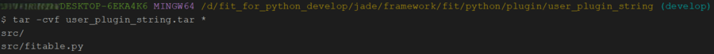

支持**热插拔**的**插件化编程**是一种软件开发模式，它允许在服务运行时**动态添加、移除和更新插件**而无需中断服务。核心思想是将应用程序的功能分解成一系列独立的插件或模块，插件可以独立开发、测试和部署，从而使得软件开发具有更好的扩展性和灵活性。

**插件的热插拔**功能是FIT框架的核心特性之一，它允许在框架运行时动态加载、卸载和更新插件，无需停止服务。插件热插拔的动态性和灵活性能够满足快速迭代和需求变更的需求，对于现代软件开发和运维非常有意义。

如[构建一个可供调用的服务](https://github.com/ModelEngine-Group/fit-framework/blob/main/docs/framework/fit/python/构建一个可供调用的服务.md)中所述，FIT for Python 中插件可分为动态插件和静态插件，本文将对于动态插件的打包方式和热插拔功能的使用 进行介绍。

## 1 动态插件打包方式

动态插件由静态插件打包而成，目前 FIT for Python 所支持的动态插件格式为 zip 和 tar 格式。

### 1.1 tar 格式的插件打包

在插件目录中执行如下命令即可：

```bash
tar -cvf 插件名.tar *
```

此时需要特别注意，务必在插件目录中执行，例如对于[构建一个可供调用的服务](https://github.com/ModelEngine-Group/fit-framework/blob/main/docs/framework/fit/python/构建一个可供调用的服务.md)中所述的`user_py_string`插件进行打包时，需要在`jade/framework/fit/python/plugin/user_py_string`目录中执行`tar -cvf user_plugin_string.tar *`，效果如下：



### 1.2 zip 格式的插件打包

将插件目录直接压缩为`插件名.zip`即可，同样以`user_py_string`插件为例，打包后的插件名称为`user_py_string.zip`，其中包括`src/fitables.py`文件。

## 2 热插拔功能使用

使用热插拔功能需要在启动框架之前添加**动态插件目录**`custom_dynamic_plugins`，之后再通过命令启动框架，此时向插件目录中添加、删除、替换插件文件即可完成插件的进行加载、卸载和更新。