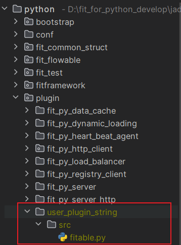
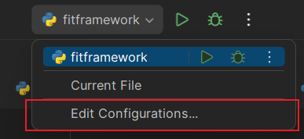
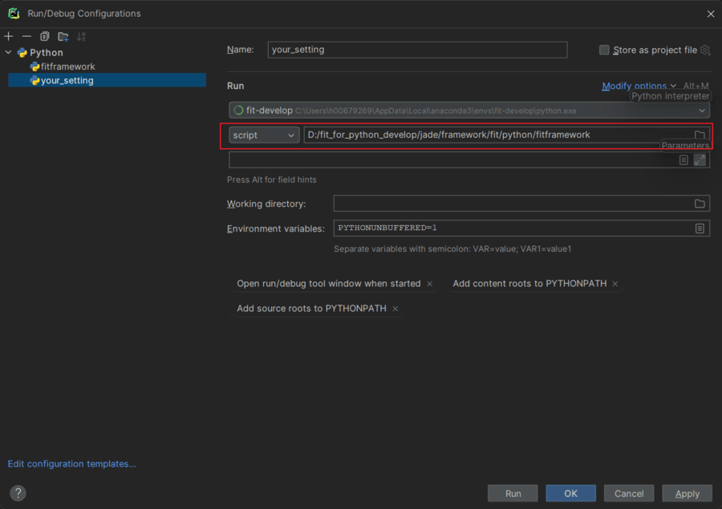
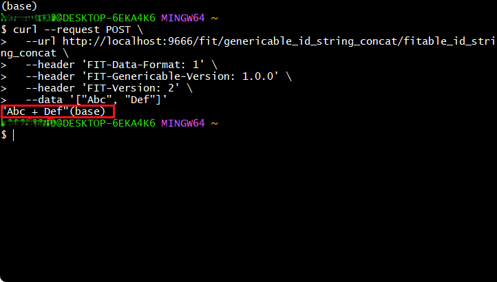
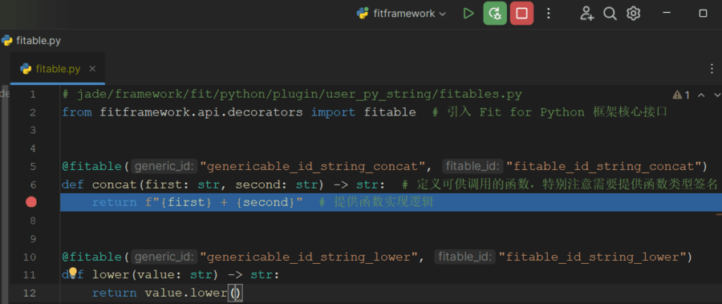

本部分将指引您如何使用 FIT for Python 构建一个基本的可供调用的函数服务，在开始之前需要您需要按照[基本概念与开发环境准备](https://github.com/ModelEngine-Group/fit-framework/blob/main/docs/framework/fit/python/基本概念与开发环境准备.md)之中所述进行开发环境的准备。

如[插件化开发](https://github.com/ModelEngine-Group/fit-framework/blob/main/docs/framework/fit/java/user-guide-book/06.%20插件化开发.md)所述，用户需要通过编写插件的方式编写自己的服务，在 FIT for Python 中插件可分为：

- 静态插件：在 FIT 框架启动前就已经准备好的插件，在框架启动时被加载，无法在框架启动后加载，由包含在特定目录中的一系列`.py`文件所组成
- 动态插件：在 FIT 框架启动后可以被加载的插件，由静态插件按照特定规则打包为`.zip`格式或`.tar`格式而成

由于动态插件是经由静态插件按特定规则打包而成，因此本文对于静态插件的编写进行描述。

## 1 插件编写

静态插件为一个目录及其中的一系列`.py`文件。

> 用户插件指包含一组`.py`文件的目录而非单一的`.py`文件，插件目录中`.py`文件的数量不限，位置不限（可位于插件根目录或其子目录）
> **特别注意**：用户插件目录中不可包括与之同名的`.py`文件，例如`string_plugin`目录中不能包含`string_plugin.py`文件。

假如您希望添加一个用于处理字符串的`user_py_string`插件，则可以在 FIT for Python 工程根目录的`plugin`目录中添加目录`user_py_string`，并在该目录下添加`fitables.py`文件以实现您的用户逻辑，文件内容如下：

```python
# jade/framework/fit/python/plugin/user_py_string/src/fitables.py
from fitframework.api.decorators import fitable  # 引入 Fit for Python 框架核心接口


@fitable("genericable_id_string_concat", "fitable_id_string_concat")  # 指定可供调用函数的 genericable id 和 fitable id
def concat(first: str, second: str) -> str:  # 定义可供调用的函数，特别注意需要提供函数类型签名
    return f"{first} + {second}"  # 提供函数实现逻辑


@fitable("genericable_id_string_lower", "fitable_id_string_lower")
def lower(value: str) -> str:
    return value.lower()
```

添加用户插件后的工程目录如下图所示：



在编写插件中的服务时，需要注意各函数的函数签名应当满足规范，可参照文档[被注解函数签名规范](https://github.com/ModelEngine-Group/fit-framework/blob/main/docs/framework/fit/python/被注解函数签名规范.md)。

## 2 框架启动、插件调用与调试

### 2.1 框架启动

#### 2.1.1 通过命令启动

Fit for Python 具备`main`函数能力，因此可通过`python`启动，在工程根目录中，直接通过命令`python -m fitframework`启动。

#### 2.1.2 通过 PyCharm 启动




如果项目工程已经通过 PyCharm 打开，则可通过如上图所示的`run`.`Edit Configurations`进入启动选项编辑页面。



在创建，其中`Script path`配置为`fitframework`所在目录，并配置好解释器，即可通过 PyCharm 进行启动和调试。

从原理上讲，本方式只是将通过命令进行启动的步骤交由 PyCharm 来做。

### 2.2 插件调用

在启动服务后，可通过 FIT 框架对外暴露的 HTTP 接口进行服务的调用，可通过`curl`的方式对于服务进行调用，调用时有如下注意事项：

- 采用 POST 方式进行请求
- HTTP 调用 URL 需要满足规定格式：`http://[服务所在 IP]:[服务所在端口]/fit/[待调用函数的 genericable id]/[待调用函数的 fitable id]`
- 向请求头中正确添加额外信息：
  
  | Header Key              | Header Value | 含义                                  |
  | ----------------------- | ------------ | ------------------------------------- |
  | FIT-Data-Format         | 1            | Body 中数据编码格式，JSON 编码代号为1 |
  | FIT-Genericable-Version | 1.0.0        | 泛服务版本，通常取 1.0.0 即可         |
  
- 按照编码格式添加 Body

```bash
curl --request POST \
  --url http://localhost:9666/fit/genericable_id_string_concat/fitable_id_string_concat \
  --header 'FIT-Data-Format: 1' \
  --header 'FIT-Genericable-Version: 1.0.0' \
  --data '["Abc", "Def"]'
```

如上所示为对运行于`localhost`并监听`9666`端口的 FIT for Python 进程中的服务进行调用的`curl`命令，服务的 GenericableId 和 FitableId 分别为 genericable_id_string_concat 和 fitable_id_string_concat，函数的两个入参分别为 "Abc" 和 "Def"。

调用结果如下：



在 curl 执行后返回的 body 中正确返回了执行的结果。

### 2.3 插件调试



在插件中添加断点，并采用 debug 方式运行框架，之后再使用 curl 进行调用时即可命中断点。