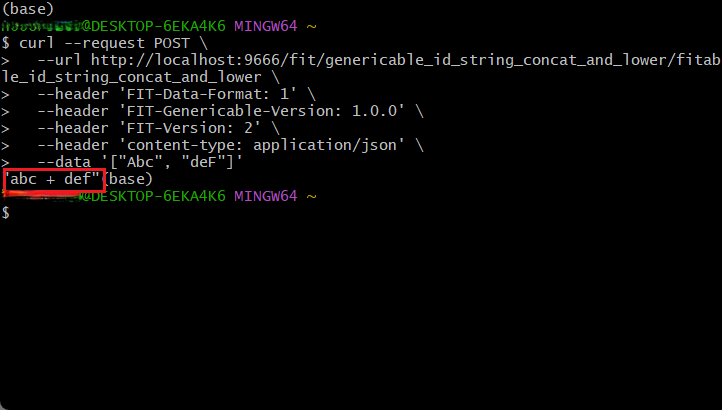

本部分将指引您如何使用 FIT for Python 调用一个已经可供调用的函数服务，在开始前您需要参照[构建一个可供调用的服务](https://github.com/ModelEngine-Group/fit-framework/blob/main/docs/framework/fit/python/构建一个可供调用的服务.md)中所述完成可供调用的服务，本文的介绍也将继续该文章进行。

## 1 编写带有发起服务调用功能的插件

继续在`plugin`目录中添加新的插件`user_plugin_string_integration`，并且同样创建`src/fitables.py`并添加如下内容：

```python
# jade/framework/fit/python/plugin/user_plugin_string_integration/src/fitables.py
from fitframework.api.decorators import fitable, fit  # 引入 Fit for Python 框架核心接口


@fit("genericable_id_string_concat")  # 指定需调用函数的 genericable id，在需要时可额外提供对于 Fitable 的指定方式
def concat(first: str, second: str) -> str:  # 声明可供调用的函数，特别注意需要提供函数类型签名
    pass


@fit("genericable_id_string_lower")
def lower(value: str) -> str:
    pass


@fitable("genericable_id_string_concat_and_lower", "fitable_id_string_concat_and_lower")
def concat_and_lower(first: str, second: str):
    return concat(lower(first), lower(second))
```

该文件中添加了一个名为`concat_and_lower`的`fitable`用于对另外两个函数服务进行调用，被调用的两个`fit`为[构建一个可供调用的服务](https://github.com/ModelEngine-Group/fit-framework/blob/main/docs/framework/fit/python/构建一个可供调用的服务.md)中所创建的两个函数服务。

此时同样通过之前介绍的方式对于框架进行启动，并利用如下命令调用`concat_and_lower`：

```bash
curl --request POST \
  --url http://localhost:9666/fit/genericable_id_string_concat_and_lower/fitable_id_string_concat_and_lower \
  --header 'FIT-Data-Format: 1' \
  --header 'FIT-Genericable-Version: 1.0.0' \
  --header 'content-type: application/json' \
  --data '["Abc", "deF"]'
```

得到结果如下：



可以看到，成功返回了将两个字符串分别转小写并且连接后的结果。