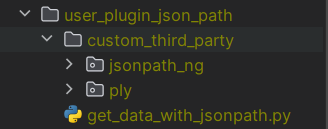
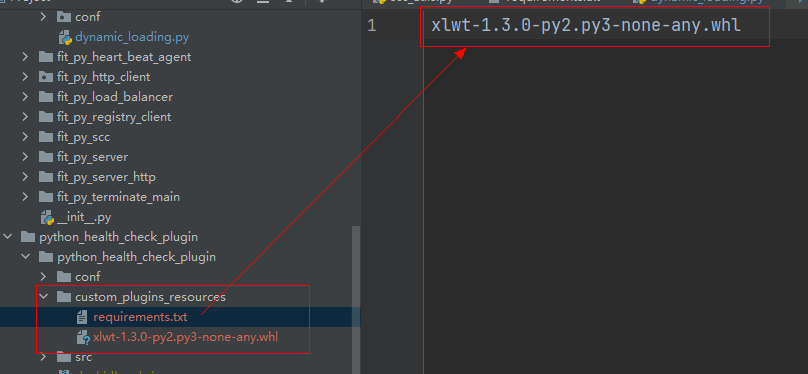

# 方式一 通过三方包源码（推荐）

通过该方式添加插件所依赖三方报，步骤如下：

1. 在插件目录中添加`custom_third_party`目录
2. 在该目录中添加**本插件所需要的三方包**以及**本插件所需要的三方包所需要的三方包**，最终插件的结构如下所示：
   
   其中`jsonpath_ng`为本插件所直接依赖的三方包，`ply`为三方包`jsonpath_ng`所依赖的三方包。

## 三方包源码的获取方式

可在本地解释器目录的`site-packages`目录中直接获取即可。

# 方式二 通过 requirements.txt （不推荐）

通过该方式添加插件所依赖的三方包，需要满足以下规范：

1. 打包的插件包下包含`custom_plugins_resources`目录，目录下包含`requirements.txt`文件，以及待安装的三方插件。
2. `requirements.txt`文件，以及待安装的三方插件必须在同一级目录下
3. `requirements.txt`文件中放置的为安装包的全名
4. 安装包必须支持`pip`命令直接安装

## 为何不推荐

使用该方式进行安装时存在以下问题：

1. 如果直接使用三方包名+版本安装，则可能会出现由于无法访问镜像源而导致的安装失败。
2. 如果使用 whl 包进行安装，则同样可能出现该 whl 包所依赖的三方包由于无法访问镜像源而导致的安装失败。
3. 即便额外准备了三方包所依赖的三方包，同样可能出现由于`requirements.txt`文件中的顺序不合理导致的安装失败。例如`jsonpath_ng`依赖了`ply`，但如果在`requirements.txt`中`jsonpath_ng`位置靠前，则仍然会由于在安装`jsonpath_ng`时自动联网安装`ply`最终导致失败。